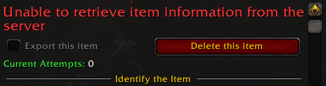

# Tracking Custom Items

You can add any item to Rarity's database and it will be tracked just like any of the standard items that are included by default.

To have the addon actually detect attempts on Custom items you added, it's critical to configure everything correctly. This page should help you accomplish just that, but feel free to ask if you can't figure out how to set up tracking for an item properly.

## Example Configuration

We'll go over a fairly standard collectible item to explain the most important fields:

> [https://www.wowhead.com/item=35275/orb-of-the-sindorei](https://www.wowhead.com/item=35275/orb-of-the-sindorei)

This item uses the following settings:

What do they mean? Well, let's take a look:

* This item has the ID ``35275``, which is used to query information about it from the server
* Attempts should be registered when looting an ``NPC`` (method of detection)
* The NPC IDs are taken directly from [wowhead's "Dropped By" tab](https://tbc.wowhead.com/item=35275/orb-of-the-sindorei#dropped-by)
* Only when one of the NPCs on this list is looted will an attempt actually be registered
* No kill statistics could be added, because Blizzard did not provide any for the Magister's Terrace dungeon
* The estimated drop rate is ``1 in 60``, i.e., ``1.667%``. This affects your "luckiness" display and nothing else
* There's no way to mark this item as "done", so it will never show any text in the "Defeated" column

Don't worry if it's not clear what these mean, they are explained in more detail below.

## Setting Up Custom Items

### Determining the Item ID

You'll need to look up identifiers for the item on [wowhead.com](https://wowhead.com). These are always numbers and can be found in the URL itself.

If you enter the wrong ID or the server doesn't recognize the item, you will see an error like this:

In this case you should double-check to make sure you got the right ID, and that it's entered in the ``Item ID`` field.

### Picking a Loot Method

The loot method determines when an attempt is triggered. It's used in conjuction with unique identifiers to make sure only items that Rarity thinks can actually be obtained are considered.

Currently, the following triggers can be detected:

* ``ARCHAEOLOGY``: Triggered when an Archaeology project is completed
* ``BOSS``: Triggered when a relevant enemy is killed (detected via scanning the combat log)
* ``COLLECTION``: Triggers when relevant items are accumulated in your inventory
* ``FISHING``: Triggers when a "Fishing" cast is completed (pool detection is tricky)
* ``NPC``: Triggers when a corpse is looted (standard loot window opens)
* ``CONTAINER``: Triggers when an item is obtained after opening another item
* ``ZONE``: Triggers when any enemy is looted in a given (sub)zone

You should select the method that most closely resembles the ingame activity/event that takes place when the item can be obtained.

### Using Kill Statistics

Blizzard provides statistics on many (if not most) modern-day raid bosses and other significant encounters as part of their Achievements API. Rarity is able to use them to automatically detect attempts.

While Blizzard doesn't provide anything other than the number of times a boss has been defeated, this information is usually more reliable than other methods of detection. It's also synchronized automatically and can therefore be restored even if you delete your Saved Variables.

In order to use kill statistics for a given item, all you have to do is find the correponsding statistic IDs from wowhead. This can usually be accomplished by simply searching for ``<boss you want to track> kills`` directly, like in this example:

The result includes all four kill statistic IDs that Blizzard implemented for the Nighthold raid:

You can extract the ID for a given difficulty directly from the wowhead URL. For this example, the URL

> [https://www.wowhead.com/achievement=10977/guldan-kills-raid-finder-nighthold](https://www.wowhead.com/achievement=10977/guldan-kills-raid-finder-nighthold)

refers to the following achievement ID:

> achievement=**10977**

Kill statistics are technically achievement criteria, so despite the naming this achievement ID (here ``10977``) is what you'll be interested in. This is the number that you can enter into the statistics field, and it's also what Rarity uses for many items that are tracked by default:

In the above screenshot, you'' notice that the achievement ID we extracted before is **not** listed. That's because it is the one tracking LFR kills, and the Living Infernal Core mount can't drop from LFR, so Rarity only uses those for Normal, Heroic, and Mythic difficulty.

Please note that the regular achievements awarded for defeating a boss aren't sufficient. Kill statistics can only be derived from the "special" (hidden) achievements that Blizzard also uses to populate your "Statistics" tab ingame. They're different from normal achievements found in the "Achievements" UI and can't be used interchangeably.

If you can't find any "kills" or "defeated" achievement for a given boss or encounter, it's likely they didn't implement statistics for it. In this case, you'll have to rely on other methods of detection.

As a final note, since Rarity caches these statistics on a per-character basis, it's possible you might encounter duplicate attempts being counted after renaming your character or transferring it to a different server. Read [this article](/docs/manua/troubleshooting/clearing-accountwide-statistics) if that is a problem you're encountering.

### Configuring the Defeat Detection

Defeat detection is an optional feature that will check items off by marking them as "defeated" in the addon's main window. This is purely cosmetic and many items aren't configured to actually use this, but they can still be tracked without this being set up.

Only a few methods for defeat detection are currently supported:

* Quest ID: Tracks whether the quests entered here are completed. Rarity will mark the item as "defeated" when they are.
* Dungeon ID: Mark the item as "defeated' when a dungeon lockout for the given dungeon exists
* Boss name: Mark it as "defeated" when a lockout for the given raid boss/encounter name exists

The latter two methods may or may not work flawlessly on non-English clients. Usually, a translation has to be provided, though Rarity uses a library to automatically look them up. This is normally good enough, but there have been cases where it isn't working. Please [report an issue](/docs/reporting-a-problem) if you encounter a problem with these methods.

One limitation of the "boss name" method is that some bosses exist in multiple places, e.g., Ragnaros or Kael'thas. Unfortunately there's no way to differentiate them (that we're aware of) so in those cases the defeat detection likely won't work reliably.

## Limitations

### Special Detection Methods

Only items that use one of the predefined methods of detection can currently be tracked. This is normally because others are more difficult to track, or no one has requested an item that would require a different method to be implemented and so we haven't bothered.

In many cases we've added workarounds to track items that don't fit this description already, so we can likely retrofit that and make similar items work. Simply let us know which item you're looking to track and we'll see what we can do.

### Multiple Sources

Only one drop rate value can be set for items that drop from multiple NPCs. It's recommended to take the average or make an estimate based on the available sample size (more recored kills means the data will be more accurate) if the item drops from multiple sources.

Items that can be obtained via entirely different means can only be tracked using one of them.

### Duplicate Names

Each item must have a unique identifier and you can't introduce duplicate names inside the Custom group, although it's possible to have two items in different groups without causing a conflict.

### "Immortal" Raid Bosses

Raid bosses and other NPCs that don't technically die (i.e., don't leave a corpse you could loot) when killed can't use the ``BOSS`` method and must instead rely on other methods of detection, or require unique workarounds.

It's recommended to use [Kill Statistics](#using-kill-statistics) for this whenever possible, as it's the easiest and most accurate way of tracking boss kills.

### Pushed Items and Loot Toasts

Items that are pushed to your inventory directly or acquired from nonstandard Loot Toasts can't be detected without unique workarounds. Rarity can usually detect that the item has been obtained, but not when an attempt was made.
