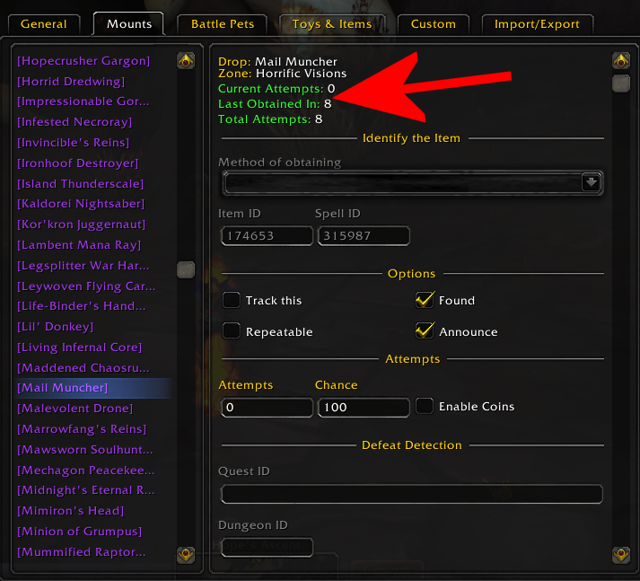

# Accessing Historical Data

You might occasionally want to access tracking data for items you've already obtained. With some limitations, you can do this.

## Displaying Recorded Attempts

There currently isn't a great way to inspect the data Rarity stores, but as of ``r710`` you can find some basic statistics in the Options UI:

Needless to say, this is a *very* basic initial proof-of-concept. A more advanced history inspection tool will be implemented soon™.

## Inspecting the Saved Variables

If you need more data than what the above display includes, you currently have two (somewhat awkward) options:

* You can go to your ``World of Warcraft\WTF\<AccountName>\SavedVariables\`` folder and open ``Rarity.lua`` in a text editor
* Ingame, you can type ``/tinspect Rarity.db.profile`` to open the database in Blizzard's Table Inspector

:::danger Beware

This will give you direct access to the Lua table that Rarity stores its database in. There's going to be a lot of confusing stuff here! It's perfectly safe to look, but if you edit the database manually and accidentally corrupt it, it could become unusable (worst case scenario). Be careful when making changes to the database, and always be ready to restore a backup if you must modifiy it.

:::

Use this at your own peril! Only manually edit in case of emergency. If you lost your attempts and wish to see whether they're still in there, you may however need to open the database and restore it from ``Rarity.lua.bak`` (located in the same folder) if it's empty.
