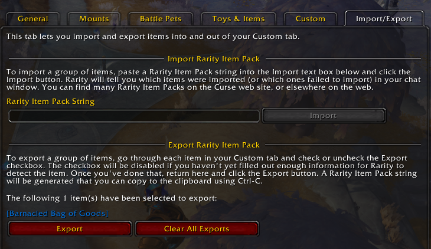
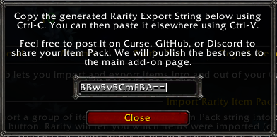

# Creating Item Packs

Item Packs are collections of items and their respective Tracking Options that can be shared with other users of the addon.

## Exporting Items

In order to export items, they must be converted to a more compact representation called an Export String. Multiple items can be encoded in this string, but you first have to select which ones should be included before  exporting an Item Pack.

Only the configuration itself is included; your attempts and personal data will not be exported.

### How to Export Items

The process for exporting items consists of three simple steps:

1. Select any number of items for exporting
2. Review the Item Pack that you will create an Export String for
3. Generate the Export String

You can then [share the Export String with others](/docs/item-packs/share).

### Selecting Items for Exporting

To select a Custom item for exporting, simply go to its item page and select the "Export this Item" checkbox:

After you've selected all items that should be included in the Item Pack, head to the "Import/Export" tab to create an Export String for it.

### Reviewing Exports

You can now review which items are currently selected to be exported:

The Tracking Options and item properties for all items shown here will be converted to an Export String as soon as you click "Export".

### Copying the Export String

Finally, a popup dialog opens to show you the Export String:

Since the WOW client doesn't allow addons to copy things on your behalf, you'll have to do it manually.

### Example Export String

The generated Export String for this example item will then look as follows:

> AzX7Af8CagrZJmU2qXITSH4BqW9Q7RTtRbsF9gPxk1QYBhlHaSgFDZaK4YIOkpKOSc4ptVCqLCWlWkxKWS5VPSSVPFX1GKjnKk0kBVNJTFZiOtVFUqnfSrpMdJ1CbYTSYcBmKD5LpY+kxHlS1DTFaZKWgZ4RRpOqxpOKTlLULYpcE7pHgZWkyFpS6LaKWVT4qstzqTCLCt81h5JvVnSD4h/p+uvCT0NdfKkzXPvOHl91ecwLs3BU1vID4Eh+D+gH/wJYTy4gnR7QBemsGJCOlnVdLt/VI4mdCK1oMeI4EkiIRoxJbH4Qgi8VZjErwinBhMyKAjbBFMyKcKoxh1kRThUzMivCqWE2Zo0Vu5g4syaKaUzLrLFiQ+ZmVoRTkM5f/wKXlwoTotrIIkGF7+qRxFpkmyjb7KCGkIDEmAbxAXd5Qr9MYSOdCVFtZNFQ4bt6JLE43gTcG28IoVgQEWMawQfc5Qn9Mvem0/lgfSD/AkvmbpZ/5b3qGlDhu3oksTiKMyUsxGGEEA4xphk+4C5P6Jc5RecD7vKEfpljh07nX7Ub/wJu3Jd87VgzNNQwRjqMNKEMvGsOwKA1ajUw4GszVvUWZtuITgI=

When this is pasted into the "Import" box, Rarity will attempt to [import](/docs/manual/importing-items) all items encoded in this string (after validating their format).

### Sharing is Caring

All that's left now is for you to [share](/docs/item-packs/share) the glorious Item Pack you just created! This will allow other players to import the configuration and add the exported items to their own Custom items group, so that they can start tracking them right away.
