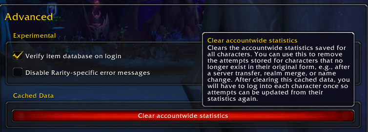

# Clearing Accountwide Statistics

Internally, the unique character ID changes when you rename or transfer your character, as Blizzard deletes and recreates it while assigning a new ID to it. This means Rarity sees it as an entirely different character, and there's no (reliable) way to detect it's actually the same as your old one.

As a workaround, you can go to the "Advanced" tab in the Options and click on the button labeled "Clear accountwide statistics".

This will delete the cached [Kill Statistics](/docs/manual/tracking-custom-items/#using-kill-statistics) obtained from Blizzard for ALL of your characters, but leave regular attempts alone. The latter will still be stored under your old character, but that can't currently be helped (until we have a better way of interacting with the database, which may be implemented in a future update).

You'll have to log into the other characters again to recover the now-removed statistics for them, but nothing should be irrevocably lost. Still, it's highly recommended to make a backup of your [SavedVariables](/docs/manual/accessing-historical-data/#inspecting-the-saved-variables) file, as the feature is experimental and has been implemented for just this special case, with very little testing going into it otherwise.
